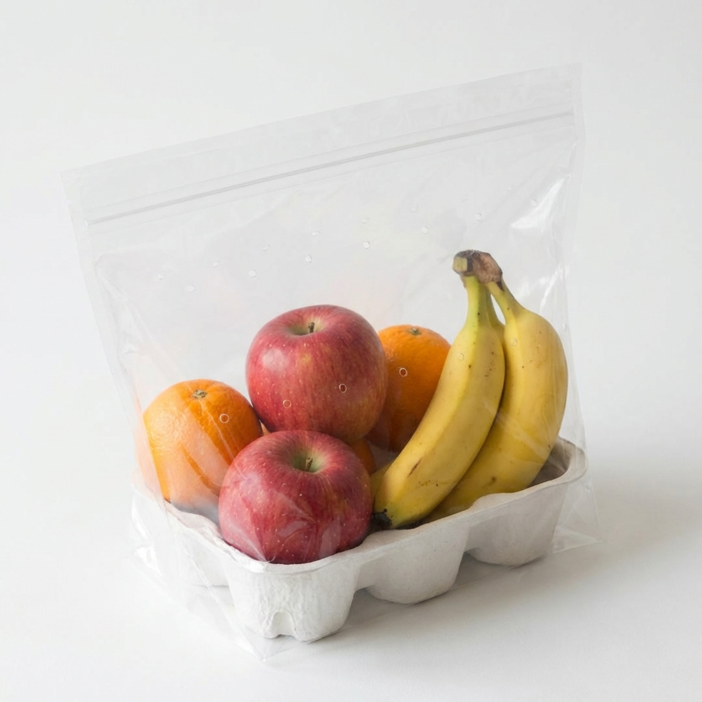
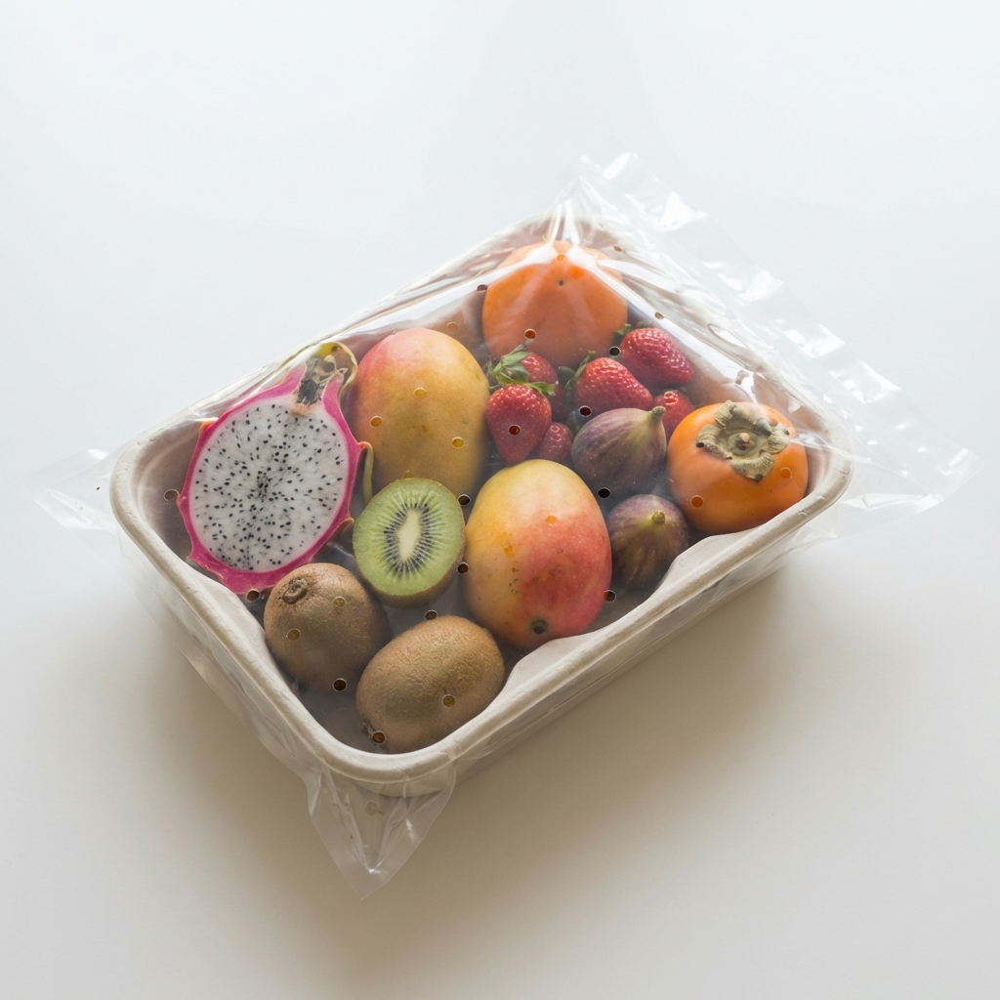

# MorningBasket 🧺

> **Fresh fruits, delivered every morning.**  
> *Cleaned with ozonated water. No cold storage. Just seasonal goodness.*


---

## 🌟 About The Project

**MorningBasket** is a premium, hyperlocal daily fruit subscription service designed to make healthy habits effortless. We believe mornings should be simple, fresh, and chemical-free.

Unlike traditional grocery apps, we operate on a **pre-order model**:
- **Harvested** based on demand.
- **Ozone-washed** to remove 99% of surface chemicals.
- **Delivered** to your doorstep before 7:00 AM.
- **No Cold Storage** involved.

---

## 🍎 Our Baskets

We offer curated baskets tailored to different family sizes, ensuring zero waste and maximum freshness.

| **Daily Essential** 🧺 | **Family Care** 👨‍👩‍👧 | **Summer Special** ☀️ |
|:---:|:---:|:---:|
|  |  |  |
| **₹199 / basket** | **₹369 / basket** | **₹449 / basket** |
| Perfect for couples. <br> Apples, Bananas, Citrus. | Ideal for families of 4. <br> Includes Papaya/Melon. | Seasonal premium picks. <br> Mangoes, Kiwis, etc. |

---

## ✨ Key Features

- **🛡️ Ozone Cleaning**: Every fruit is washed with commercial-grade ozone technology.
- **⚡ Superfast Morning Delivery**: Optimized logistics for 5 AM - 7 AM delivery slots.
- **📅 Smart Subscriptions**: Pause, resume, or skip deliveries with a single tap.
- **🏡 Society-Specific**: We launch society-by-society to ensure density and service quality.
- **📱 Mobile First**: A seamless mobile web experience built with Next.js.
- **🔐 Secure Auth**: OTP-based login for a frictionless user experience.

---

## 🎨 Recent Frontend Updates (Feb 2026)

- **Redesigned "How It Works" Journey**: Upgraded from simple icons to a premium, 4-step photo-driven HD layout (Order ➔ Farm Procurement ➔ Ozone Cleansing ➔ Doorstep Delivery).
- **New Pages**: Added comprehensive **Refund Policy** and detailed **About Us** pages.
- **Visual Enhancements**: Added "Why Choose Us" and "Our Promise" trust-building sections to the homepage.
- **Brand Consistency**: Applied premium organic styling (olive greens, clean creams, soft shadows) across all new components.

---

## 🛠️ Tech Stack

Built with a focus on performance, scalability, and developer experience.

### **Frontend**
- **Framework**: [Next.js 14](https://nextjs.org/) (App Router)
- **Styling**: [Tailwind CSS 4](https://tailwindcss.com/)
- **Language**: [TypeScript](https://www.typescriptlang.org/)
- **Icons**: [Lucide React](https://lucide.dev/)

### **Backend**
- **Runtime**: [Node.js](https://nodejs.org/)
- **Framework**: [Express.js](https://expressjs.com/)
- **Database**: [PostgreSQL](https://www.postgresql.org/)
- **ORM**: [Prisma](https://www.prisma.io/)
- **Auth**: JWT & OTP Service

---

## 🚀 Getting Started

Follow these steps to set up the project locally.

### Prerequisites
- Node.js 18+
- PostgreSQL
- npm or yarn

### Installation

1.  **Clone the repository**
    ```bash
    git clone https://github.com/AtharvaMeherkar/morning-basket-website.git
    cd morning-basket-website
    ```

2.  **Setup Backend**
    ```bash
    cd backend
    npm install
    # Configure .env file (see .env.example)
    npm run db:generate
    npm run db:push
    npm run dev
    ```

3.  **Setup Frontend**
    ```bash
    cd frontend
    npm install
    npm run dev
    ```

4.  Open [http://localhost:3000](http://localhost:3000) to view the app!

---

## 📂 Project Structure

```bash
MorningBasket/
├── frontend/          # Next.js Application
│   ├── src/app/       # App Router Pages
│   ├── public/        # Images & Assets
│   └── ...
├── backend/           # Node.js API
│   ├── src/routes/    # API Routes
│   ├── prisma/        # Database Schema
│   └── ...
└── README.md          # Project Documentation
```

---

## 📝 License

Private Property of **MorningBasket** © 2026.  
*Designed & Developed with ❤️ for better mornings.*
