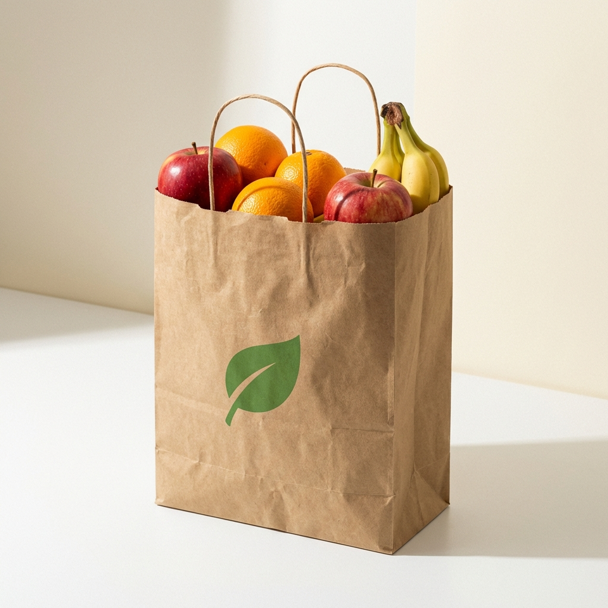

# MorningBasket 🧺

> **Fresh fruits, delivered every morning.**  
> *Cleaned with ozonated water. No cold storage. Just seasonal goodness.*



---

## 🌟 About The Project

**MorningBasket** is a premium, hyperlocal daily fruit subscription service designed to make healthy habits effortless. We believe mornings should be simple, fresh, and chemical-free.

Unlike traditional grocery apps, we operate on a **pre-order model**:
- **Harvested** based on demand.
- **Ozone-washed** to remove 99% of surface chemicals.
- **Delivered** to your doorstep before 7:00 AM.
- **No Cold Storage** involved.

---

## 🍎 Our Curated Baskets

We offer carefully curated, fixed baskets tailored to different family sizes, eliminating daily cart building and decision fatigue.

| **Daily Essential** 🧺 | **Small Family Care** 👨‍👩‍👧 | **Family Care** 👨‍👩‍👧‍👦 | **Summer Special** ☀️ |
|:---:|:---:|:---:|:---:|
|  |  |  |  |
| **₹199 / basket** | **₹249 / basket** | **₹379 / basket** | **₹299 / basket** |
| Perfect for individuals or couples. <br> Essential daily fruits. | Ideal for small families. <br> Balanced mix. | For medium-large families. <br> Maximum variety. | Refreshing premium picks. <br> Seasonal favourites. |

---

## ✨ Key Features

- **🛡️ Ozone Cleaning**: Every fruit is washed in a 100% hygienic ozone bath to remove pesticides, bacteria, and impurities.
- **⚡ Superfast Morning Delivery**: Impeccably clean fruit baskets at your door between 6 AM - 10 AM, ready for breakfast.
- **📅 Smart Subscriptions**: Fixed baskets with flexible scheduling (daily, alternate days).
- **📦 No Cold Storage**: Purchased fresh from local farms at 4 AM, delivered by 8 AM. Never stored overnight.
- **📱 Mobile First**: A seamless mobile web experience built with Next.js.

---

## 🎨 Recent Major Updates (Feb 2026)

- **Completely Redesigned "How It Works" Journey**: We transitioned from basic icons to a stunning, 4-step photo-driven HD layout that visually tells our story:
  - **Step 1 (Order by 10 PM)**: Clean, catalogue-style ordering UX.
  - **Step 2 (Fresh at 4 AM)**: Authentic sunrise farm procurement imagery.
  - **Step 3 (Ozone Cleansed)**: Visualizing our rigorous splash-cleaning hygiene process.
  - **Step 4 (Home by 8 AM)**: A beautiful, ready-to-eat morning breakfast experience.
- **Basket Lineup & Pricing Overhaul**: Updated pricing and imagery for all 4 primary baskets, reflecting current offerings (Starting at ₹199).
- **New Core Pages Added**: 
  - Comprehensive **Refund Policy** page for checkout trust.
  - Detailed **About Us** page telling the MorningBasket brand story.
- **Trust Elements**: Added extensive Homepage sections for "Why Choose Us" and a brand "Promise" dedicated to quality without compromise.
- **Visual Aesthetic Refinement**: Standardized on a premium, organic "farm-to-table" design system (Olive greens, Cream backgrounds, Soft dropping shadows, Clean typography).

---

## 🛠️ Tech Stack

Built with a focus on performance, scalability, and developer experience.

### **Frontend**
- **Framework**: [Next.js 14](https://nextjs.org/) (App Router)
- **Styling**: [Tailwind CSS 4](https://tailwindcss.com/)
- **Language**: [TypeScript](https://www.typescriptlang.org/)
- **Icons**: [Lucide React](https://lucide.dev/)

### **Backend**
- **Runtime**: [Node.js](https://nodejs.org/)
- **Framework**: [Express.js](https://expressjs.com/)
- **Database**: [PostgreSQL](https://www.postgresql.org/)
- **ORM**: [Prisma](https://www.prisma.io/)
- **Auth**: JWT & OTP Service

---

## 🚀 Getting Started

Follow these steps to set up the project locally.

### Prerequisites
- Node.js 18+
- PostgreSQL
- npm or yarn

### Installation

1.  **Clone the repository**
    ```bash
    git clone https://github.com/AtharvaMeherkar/morning-basket-website.git
    cd morning-basket-website
    ```

2.  **Setup Backend**
    ```bash
    cd backend
    npm install
    # Configure .env file (see .env.example)
    npm run db:generate
    npm run db:push
    npm run dev
    ```

3.  **Setup Frontend**
    ```bash
    cd frontend
    npm install
    npm run dev
    ```

4.  Open [http://localhost:3000](http://localhost:3000) to view the app!

---

## 📂 Project Structure

```bash
MorningBasket/
├── frontend/          # Next.js Application
│   ├── src/app/       # App Router Pages
│   ├── public/        # Images & Assets
│   └── ...
├── backend/           # Node.js API
│   ├── src/routes/    # API Routes
│   ├── prisma/        # Database Schema
│   └── ...
└── README.md          # Project Documentation
```

---

## 📝 License

Private Property of **MorningBasket** © 2026.  
*Designed & Developed with ❤️ for better mornings.*
